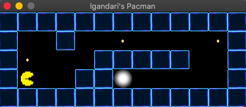

# so_long

## Introduction

In this project, I have developed a small 2D game. 
The game consists of a character collecting objects on a map and searching for the exit.

## Usage
1. Clone the repository to your local machine using the following command:
    ```
    git clone https://github.com/lgandarillas/so_long.git
    ```
2. Navigate to the project directory:
    ```
    cd so_long
    ```
3. Compile the project by running the Makefile:
    ```
    make
    ```
4. Execute the game by running the executable along with the path to a valid map file in .ber format. For example:
    ```
    ./so_long maps/valid/map.ber
    ```
   This will launch the game using the specified map.
5. To play the game, use the arrow keys or WASD to move the character. Collect all the objects and reach the exit to win the game.

Note: While this project is primarily designed to run on macOS, it can potentially be adapted to run on Linux systems as well. Additional steps may be required for Linux compatibility.



## Project Structure
My project is structured as follows:

- **Makefile**: Contains the rules to compile the project.
- **src/**: Folder containing all the source files of the project.
- **inc/**: Folder containing the header files.
- **maps/**: Folder containing the maps in .ber format.
- **img/**: Folder containing the textures used in the game.
- **libft_v2/**: Library folder containing additional utility functions.
- **mlx/**: Folder containing the MiniLibX library used for graphics handling.   

## Implementation

### Using MiniLibX Functions

For graphics management in the game, I utilized MiniLibX, a simple yet powerful graphics library. I learned to use its basic functions for opening windows, drawing images, and handling keyboard and mouse events.

### Map Interpretation

I developed a system to interpret maps in .ber format. This involved reading the file, validating it, and then loading the map data into a suitable data structure.

### Character Movement

I implemented the logic to allow the character to move on the map. This included collision detection with obstacles and updating the character's position in the window.

### User Interface

I designed a simple but intuitive user interface. I displayed the map and the character in a window, along with information such as the number of objects collected and the movements made.

## Conclusions

The development of this project was a rewarding experience. I learned a lot about graphical programming and event handling in C. Additionally, I improved my skills in structuring and organizing software projects. I am satisfied with the final result and eager to continue developing my skills in future projects.
